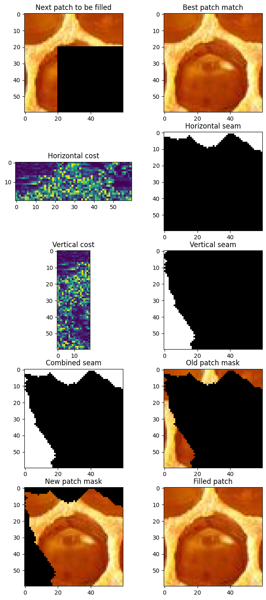

**Full report of the process and results can be found in [AnalysisReport.pdf](https://github.com/OlaPietka/Texture-Transfer/blob/main/AnalysisReport.pdf)**

# Image Quiliting
The goal of this project is to implement the image quilting algorithm for texture synthesis and transfer,
described by [*Efros and Freeman (2001)](https://www2.eecs.berkeley.edu/Research/Projects/CS/vision/papers/efros-siggraph01.pdf).

## Custom seam finding algorithm
Dynamic programming is a commonly used technique for seam finding in image quilting. We first define source patch and a patch (target) that closely match the source region to be filled in. Next, we compute cost matrix for overlapping regions, and find the minimum-energy seam that separates the the regions. The seams are then stitched together and applied into target and source patch to create coherent output.

## Texture transfer
Texture transfer is a technique that involves transferring the texture of one image to another image, while
preserving the structure and content of the target image. The goal of texture transfer is to create a new image
that has the same visual appearance and texture as the source image, but with a different content.

Texture image  |  Guidance image  |  Texture transfer  |  Iterative texture transfer
:-------------------------:|:-------------------------:|:-------------------------:|:-------------------------:
  |    |    |  
